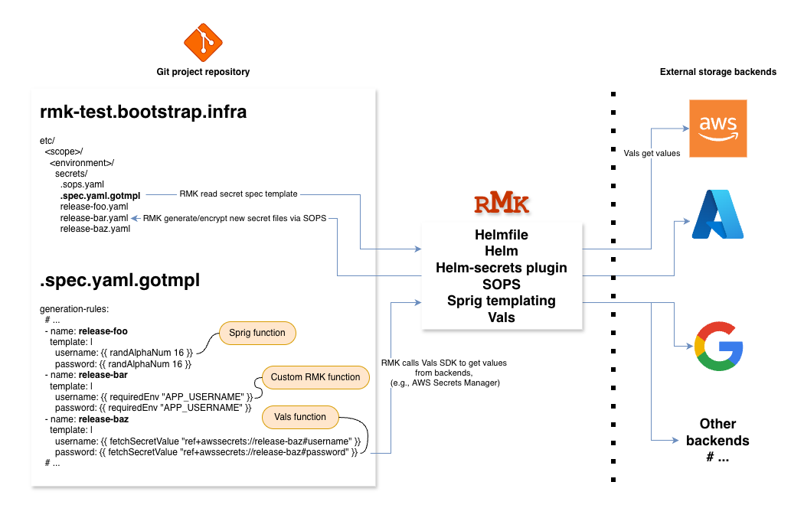

# Integration with Helmfile vals

## Overview



## Classic secrets management via Git, SOPS and Age

RMK utilizes [SOPS](https://github.com/mozilla/sops) and [Age](https://github.com/mozilla/sops#encrypting-using-age)
for [secrets management](./secrets-management.md). This provides a consistent and auditable mechanism for handling
secrets.

RMK also promotes [batch secrets management](./batch-secrets-management.md), an approach for generating and
maintaining secrets in batch mode.

Key characteristics of the **Git-based** approach:

- Secrets are generated and encrypted using [Golang templates](https://pkg.go.dev/text/template)
  and [Sprig](https://masterminds.github.io/sprig) functions.
- Encrypted files are stored and versioned in [Git](https://git-scm.com/).
- Encryption keys and secret rotation are managed by repository administrators or release managers.
- Operates per project, scope, and environment level.

> This approach for secrets management remains the **standard** and **manual** method in RMK.

## Alternative secrets management via Helmfile vals and remote backends

### Introduction

[Helmfile](https://helmfile.readthedocs.io/en/latest/) is used by RMK as its declarative release management layer
for [Helm](https://helm.sh/)-based deployments.  
It includes built-in integration with [vals](https://github.com/helmfile/vals), allowing configuration parameters
and secrets to be dynamically resolved from **external backends** during render time.

Popular vals backends include:

- [awssecrets](https://github.com/helmfile/vals?tab=readme-ov-file#aws-secrets-manager) – [AWS Secrets Manager](https://aws.amazon.com/secrets-manager/)
- [gcpsecrets](https://github.com/helmfile/vals?tab=readme-ov-file#gcp-secrets-manager) – [Google Secret Manager](https://cloud.google.com/security/products/secret-manager)
- [azurekeyvault](https://github.com/helmfile/vals?tab=readme-ov-file#azure-key-vault) – [Azure Key Vault](https://azure.microsoft.com/en-us/products/key-vault)
- [vault](https://github.com/helmfile/vals?tab=readme-ov-file#vault) – [HashiCorp Vault](https://www.hashicorp.com/en/products/vault)
- [1password](https://github.com/helmfile/vals?tab=readme-ov-file#1password) – [1Password Connect](https://1password.com/)

See [Supported Backends](https://github.com/helmfile/vals#supported-backends) for the full list.

> This approach provides RMK with additional flexibility and extends its secrets management capabilities — particularly
> useful when customers or release managers choose to **leverage** existing **third-party** secrets management systems.

### Basic usage with full vals delegation

During Helmfile rendering via RMK, vals **recursively** scans all 
[YAML structures](https://en.wikipedia.org/wiki/YAML#Syntax)
(maps, lists, scalar values) for strings that start with `ref+`. Each such value is resolved via the corresponding
backend provider (e.g., AWS Secrets Manager, Vault, SOPS).  
If a `ref+` reference is found **inside a larger string**, vals **does not process it** — only standalone values are
supported.

**Example:**

```yaml
releases:
  - name: my-app
    namespace: default
    chart: ./chart
    values:
      - values.yaml
      - secrets:
          dbUser: ref+awssecrets://production/my-app/database#username
          dbPassword: ref+awssecrets://production/my-app/database#password
          # This line will NOT be resolved by vals
          dbUrl: "postgres://user:ref+awssecrets://production/my-app/database#password@db"
```

In this example:

- `Helmfile` automatically invokes vals **before rendering**.
- `vals` recursively **replaces** all standalone `ref+...` strings with resolved values.
- Inline references (like in `dbUrl`) **remain untouched** and must be constructed inside Helm templates instead.
- RMK orchestrates the Helmfile execution **without intercepting** or **modifying** the secret resolution process.

> This mode provides full transparency and minimal coupling. RMK **does not process** or **transform** secrets 
> itself, it instead **delegates** secret resolution **entirely** to vals,
> relying on external backends for secret retrieval, access control, and rotation.

### Batch secrets management with vals integration

RMK **extends** its classic batch secrets management mechanism with the ability to **fetch** and **resolve** secrets
from **remote backends** through vals during template generation.  
This allows users to **automatically** populate secret templates from systems such as AWS Secrets Manager, Google
Secret Manager, or Azure Key Vault, and then **store** the generated values **locally** in encrypted form via SOPS,
following the standard Git-based approach.

Secrets are retrieved in batch using the `fetchSecretValue` template function (equivalent to Helmfile’s
[implementation](https://helmfile.readthedocs.io/en/latest/remote-secrets/#fetching-single-key)).  
After resolution, the resulting files are to be **encrypted** with SOPS and safely **committed** to Git — giving release
managers full control and auditability while still leveraging remote backends for secret retrieval.

> This approach is particularly useful when teams:
> 
> - prefer to maintain secrets in Git for **visibility** and **versioning**,
> - want to **avoid manual** entry by pulling values **automatically** from external systems,
> - may still keep `ref+` values in templates for **dynamic runtime resolution**.

#### Example fetchSecretValue function usage

```yaml
generation-rules:
  - name: new-app
    template: |
      # Secrets fetched during generation via vals
      username: {{ fetchSecretValue "ref+awssecrets://production/new-app/app#username?region=us-east-1" }}
      password: {{ fetchSecretValue "ref+awssecrets://production/new-app/app#password?region=us-east-1" }}

      # Ref-style dynamic value — still delegated to vals and resolved by it at Helmfile render time or release sync
      apiToken: ref+awssecrets://production/new-app/api#credentials/token?region=us-east-1
```

When `fetchSecretValue` is used:

- RMK invokes vals to **resolve** each referenced secret during template generation.
- vals **connects** to the appropriate backend (e.g., AWS, GCP, Azure) using the credentials available in the
  environment.
- Each `ref+<backend>://...` reference **points** to a specific secret path and key within that backend.
- Retrieved values are **injected** into the generated template prior to encryption.

After the template is rendered:

- RMK **encrypts** the generated secret files using **SOPS**, maintaining the Git-based workflow and audit history.
- Any remaining `ref+` entries **stay untouched** and are **dynamically resolved** by vals at render time during
  Helmfile execution.

> This end-to-end flow ensures that secrets can be **securely fetched**, optionally **stored** in Git in encrypted form,
> and still **benefit** from **runtime resolution** for any remaining dynamic references.

#### Example secret structure in AWS Secrets Manager

Secret name: `production/new-app/app`

```json
{
  "username": "app-user",
  "password": "app-pass"
}
```

Secret name: `production/new-app/api`

```json
{
  "credentials": {
    "token": "abcd-1234-xyz"
  }
}
```

Referenced in template:

```yaml
username: '{{ fetchSecretValue "ref+awssecrets://production/new-app/app#username?region=us-east-1" }}'
password: '{{ fetchSecretValue "ref+awssecrets://production/new-app/app#password?region=us-east-1" }}'
apiToken: '{{ fetchSecretValue "ref+awssecrets://production/new-app/api#credentials/token?region=us-east-1" }}'
```

##### Required permissions

**AWS SSM Parameter Store**

- `ssm:GetParameter`
- `ssm:GetParameters`
- `ssm:GetParametersByPath`
- `kms:Decrypt` (for SecureString parameters)

**AWS Secrets Manager**

- `secretsmanager:GetSecretValue`
- `secretsmanager:DescribeSecret`
- `kms:Decrypt` (if custom CMK is used)

Example IAM policy:

```json
{
  "Effect": "Allow",
  "Action": [
    "ssm:GetParameter",
    "ssm:GetParameters",
    "ssm:GetParametersByPath",
    "secretsmanager:GetSecretValue",
    "secretsmanager:DescribeSecret"
  ],
  "Resource": [
    "arn:aws:ssm:REGION:ACCOUNT_ID:parameter/PATH/*",
    "arn:aws:secretsmanager:REGION:ACCOUNT_ID:secret:SECRET_PREFIX-*"
  ]
}
```

For encrypted secrets (KMS):

```json
{
  "Effect": "Allow",
  "Action": [
    "kms:Decrypt"
  ],
  "Resource": "arn:aws:kms:REGION:ACCOUNT_ID:key/KEY_ID_OR_UUID"
}
```

#### Example secret structure in Google Secret Manager

Secret name: `my-secret`

Secret value: `my-db-password-123`

Referenced in template:

```yaml
dbPassword: '{{ fetchSecretValue "ref+gcpsecrets://my-secret" }}'
```

##### Required permissions

**Secret Manager**

- Role: `roles/secretmanager.secretAccessor`

```bash
gcloud projects add-iam-policy-binding PROJECT_ID \
  --member="serviceAccount:SA_NAME@PROJECT_ID.iam.gserviceaccount.com" \
  --role="roles/secretmanager.secretAccessor"
```

**Cloud KMS** (optional, if secrets encrypted with KMS)

- Role: `roles/cloudkms.cryptoKeyDecrypter`

```bash
gcloud kms keys add-iam-policy-binding KEY_NAME \
  --keyring=KEYRING_NAME --location=LOCATION \
  --member="serviceAccount:SA_NAME@PROJECT_ID.iam.gserviceaccount.com" \
  --role="roles/cloudkms.cryptoKeyDecrypter"
```

#### Example secret structure in Azure Key Vault

Secret name: `new-app-api-key`

Secret value: `abc123xyz987`

Referenced in template:

```yaml
apiKey: '{{ fetchSecretValue "ref+azurekeyvault://my-keyvault/new-app-api-key" }}'
```

##### Required permissions

Minimum role: **Key Vault Secrets User**

```bash
AZURE_VAULT_NAME=my-vault
AZURE_PRINCIPAL_ID=<object_ID_of_service_principal_or_managed_identity>
AZURE_SCOPE=$(az keyvault show -n "${AZURE_VAULT_NAME}" --query id -o tsv)

az role assignment create \
  --assignee-object-id "${AZURE_PRINCIPAL_ID}" \
  --assignee-principal-type ServicePrincipal \
  --role "Key Vault Secrets User" \
  --scope "${AZURE_SCOPE}"
```

#### Automatic credential injection during template generation

RMK **automatically** passes active **provider credentials** into the context of template generation,  
allowing **seamless** secret resolution from remote backends (e.g., AWS Secrets Manager, Azure Key Vault, GCP Secret
Manager) **without manual** credential setup.

For details about all supported cluster providers and their configuration attributes, see  
[Configuration Management](../configuration-management/configuration-management.md#list-of-main-attributes-of-the-rmk-configuration).

For example, when a cloud provider such as AWS, Azure, or GCP is initialized using:

```bash
rmk config init --cluster-provider aws
```

RMK stores the credentials for that provider and **automatically injects** them during  
`rmk secret manager generate`, enabling vals to access the respective backend **transparently**. 
As a result, secret references such as `ref+awssecrets://production/app#password` are **resolved automatically** at 
generation time — no environment configuration required.

#### Cross-provider access in a single secrets template

If you need to access secrets from an **additional** provider that **differs** from the active one,  
**export** the required environment variables to pass the needed credentials to the template generator.

For example, when the currect cluster provider is AWS:

```bash
rmk config init --cluster-provider aws
```

But Azure and GCP are refenced additionaly from the same template, e.g.:

```yaml
generation-rules:
  - name: multi-provider-example
    template: |
      # AWS-provided secrets (default provider context)
      database:
        username: {{ fetchSecretValue "ref+awssecrets://production/app-db#username?region=us-east-1" }}
        password: {{ fetchSecretValue "ref+awssecrets://production/app-db#password?region=us-east-1" }}

      # GCP-provided secret (requires GOOGLE_APPLICATION_CREDENTIALS)
      gcp:
        apiKey: {{ fetchSecretValue "ref+gcpsecrets://projects/my-project/secrets/external-api-key/versions/latest" }}

      # Azure-provided secret (requires AZURE_CLIENT_ID, AZURE_CLIENT_SECRET, AZURE_TENANT_ID)
      azure:
        storageKey: {{ fetchSecretValue "ref+azurekeyvault://my-vault/storage-key" }}

      # Optional dynamic vals references still supported
      metrics:
        token: ref+vault://secret/data/observability#data.token
```

You should explicitly export the variables, e.g.:

```bash
# AWS variables are exported automatically and always take priority over any exports
# Extra variables are required to be exported manually
export GOOGLE_APPLICATION_CREDENTIALS=/path/to/gcp-key.json
export AZURE_CLIENT_ID=<azure_client_id>
export AZURE_CLIENT_SECRET=<azure_client_secret>
export AZURE_TENANT_ID=<azure_tenant_id>

rmk secret manager generate --scope rmk-test --environment production
```

> While the functionality is fully supported, it is considered **advanced** and should be used only when **explicitly
> required**.
 